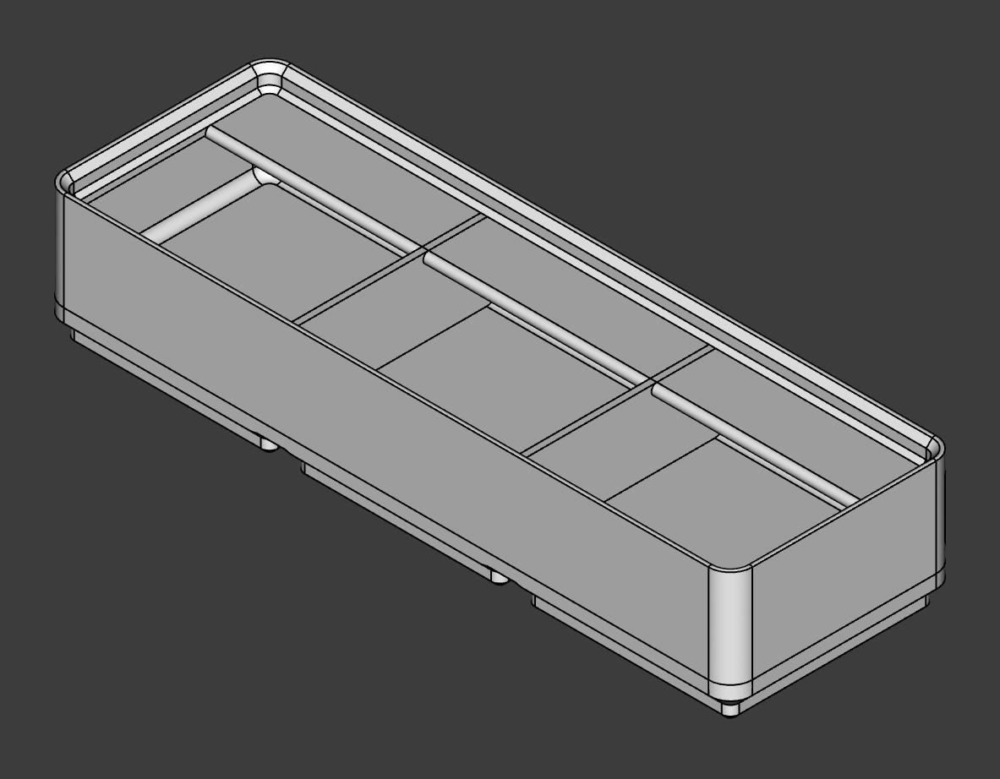

# FreeCad_gridfinity
Recreation of the gridfinity system in FreeCad.

Created with [Realthunders FreeCad branch](https://github.com/realthunder/FreeCAD/releases) due to the suppresion and expression features.

## Features

- variable number of slots
- variable number of compartments
- variable height
- toggable magnet holes
- toggable sticker lip
- toggable finger slide (sort of, I did not like the original finger slide)
